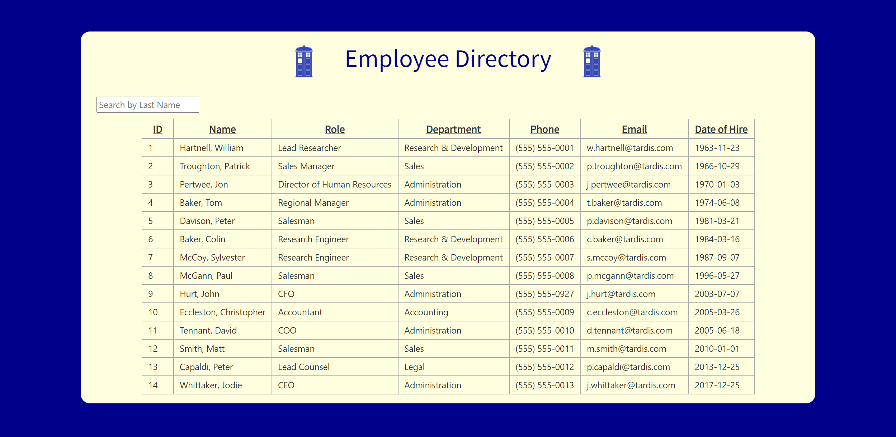
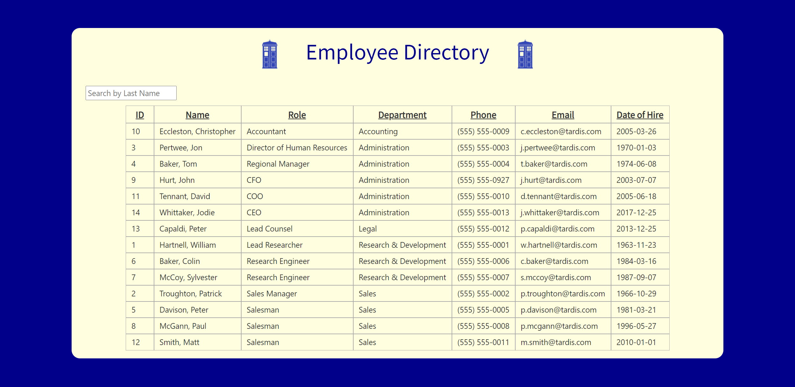
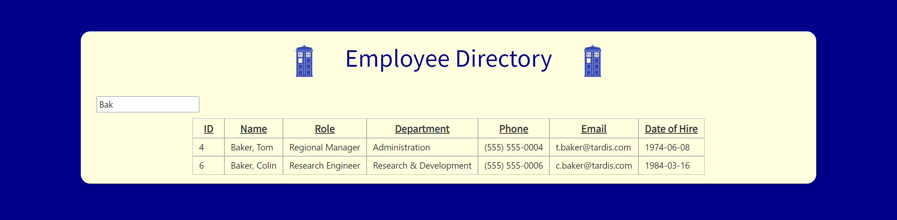

# React Employee Directory

## Table of Contents

* [Description](#description)
* [Links](#links)
* [Screenshots](#screenshots)
* [Installation Instructions](#installation-instructions)
* [Usage](#usage)
* [Technologies Used](#technologies-used)
* [Tests](#tests)
* [Credits](#credits)
* [Contributing](#contributing)
* [Questions](#questions)
* [Badges](#badges)

## Description

This application uses React to generate and manipulate a table of employee information. The user can click on any column header to sort the table by that column, or type into the input box to search for an employee by last name. Reloading the page following a name search will reset the table to show all employees.

## Links

[Deployed application on GitHub Pages](https://lauracole1900.github.io/reactEmployeeDirectory/)

## Screenshots

Directory with default sort (by employee ID):


Directory sorted by department:


Searching by last name:


## Installation Instructions

If you want to run a copy of this app on your local machine, first clone the repository:

HTTPS:
```
$ git clone https://github.com/LauraCole1900/reactEmployeeDirectory.git
```

SSH:
```
$ git clone git@github.com:LauraCole1900/reactEmployeeDirectory.git
```

Then cd/ into the cloned directory and download the dependencies by typing into the command line
```
$ npm install --save
```

Once the dependencies are installed, start the application by typing into the command line
```
$ npm start
```

## Usage

This project is intended to be used to find employees in a directory.

## Technologies Used

Node.js, React

## Tests

npm run test

## Credits

N/A

## Contributing

We believe code is never finished, welcome your contributions to enhance the applications functionality. Please adhere to the Code of Conduct for the Contributor Covenant, version 2.0, at https://www.contributor-covenant.org/version/2/0/code_of_conduct.html.

## Questions

If you have further questions, you can reach me at lauracole1900@comcast.net. For more of my work, see [my GitHub](https://github.com/LauraCole1900).

## Badges

 [](https://open.vscode.dev/LauraCole1900/reactEmployeeDirectory)